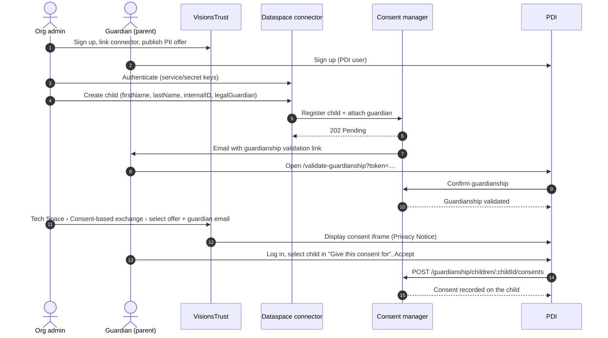

# Guardianship (Parental Consent) — Connector Documentation

This document describes the **guardianship** feature end to end: how a legal guardian (parent) can give consent **on behalf of a minor** within the dataspace.

The dataspace connector is the bridge between all the components involved, which is why this global documentation lives in the connector repository. A consent-focused document is maintained separately in the consent-manager repository.
 
---

## Table of contents

1. [Overview](#1-overview)
2. [Components and roles](#2-components-and-roles)
3. [End-to-end flow](#3-end-to-end-flow)
4. [Prerequisites](#4-prerequisites)
5. [Connector API: creating a child](#5-connector-api-creating-a-child)
6. [Guardianship validation](#6-guardianship-validation)
7. [Giving consent on behalf of a child](#7-giving-consent-on-behalf-of-a-child)
8. [Verifying the result](#8-verifying-the-result)
9. [End-to-end UI test guide](#9-end-to-end-ui-test-guide)
10. [Feature flags and configuration](#10-feature-flags-and-configuration)
11. [Troubleshooting](#11-troubleshooting)
12. [Quick reference](#12-quick-reference)
---

## 1. Overview

A minor cannot give consent for the processing of their personal data by themselves. With the guardianship feature:

- A **child account** (managed account, no password) is created **through the connector** and attached to a **legal guardian**.
- The guardian **confirms** the guardianship relationship from PDI.
- When a consent is requested (e.g. through the consent iframe), the guardian can choose to consent **for themselves** or **on behalf of one of their children**.
- A consent given on behalf of a child is stored on the **child**, with a trace of who performed it (the guardian).
> **Important:** there is no "add a child" screen in PDI. Child accounts are **only** created through the dataspace connector.
 
---

## 2. Components and roles

### Components

| Component | Responsibility in this feature |
| :-- | :-- |
| **VisionsTrust** | Organization registration, connector linking, projects, offers (with PII), consent iframe generation (Tech Space). |
| **Dataspace connector** | Authenticates the participant and **registers child accounts** with the consent manager, attached to a guardian. |
| **Consent manager** | Stores child accounts, guardianship relationships and consents. Sends the guardianship validation email. Exposes the "consent on behalf" endpoint. |
| **PDI** | End-user interface: guardian sign-up/login, guardianship validation, consent screen (embedded in an iframe), list of associated users and their consents. |

### The three accounts (do not mix them up)

| Role | Where it lives | How it is created |
| :-- | :-- | :-- |
| **Organization admin** | VisionsTrust | VisionsTrust sign-up flow |
| **Guardian (parent)** | PDI | PDI sign-up |
| **Child (minor)** | PDI / consent manager | Created by the **connector** — no UI |
 
---

## 3. End-to-end flow


 
---

## 4. Prerequisites

Before testing or using the feature:

1. **A VisionsTrust organization** with an admin account.
2. **A linked connector**: in VisionsTrust › *My Tech Space*, the *Connector configuration* card must show that the connector is linked (green). The exchange tabs stay hidden until it is.
3. **At least one published offer containing personal data (PII)**. The data resource of the offer must be flagged as containing personal data. Unpublished offers or offers without PII are not selectable in the consent step.
4. **A guardian account in PDI**, and the guardian's **PDI user identifier** (or email), needed to attach the child.
5. **A user identifier for the guardian on the connector side** (required by the consent iframe flow, see [Troubleshooting](#11-troubleshooting)).
---

## 5. Connector API: creating a child

Child creation is a **connector/API step**. PDI confirms this on the *Associated users* page: *"New child accounts are created via the dataspace connector."*

### 5.1 Authenticate

Authenticate against the connector login endpoint using the participant's service and secret keys.

```http
POST <CONNECTOR_URL>/login
Content-Type: application/json
 
{
  "serviceKey": "<SERVICE_KEY>",
  "secretKey": "<SECRET_KEY>"
}
```

Use the returned token as a Bearer token for the next call.

> **TODO:** confirm the exact login route and response shape against the current connector version.

### 5.2 Register the child

The connector registers the child with the consent manager, with the guardian attached.

```http
POST <CONNECTOR_URL>/<CHILD_CREATION_ENDPOINT>
Authorization: Bearer <TOKEN>
Content-Type: application/json
 
{
  "firstName": "Test",
  "lastName": "Child1",
  "internalID": "child-001",
  "legalGuardian": "<GUARDIAN_PDI_USER_ID or guardian email>"
}
```

> **TODO:** replace `<CHILD_CREATION_ENDPOINT>` with the actual connector route.

| Field | Type | Required | Description |
| :-- | :-- | :-- | :-- |
| `firstName` | string | yes | Child's first name (displayed to the guardian as "First Last"). |
| `lastName` | string | yes | Child's last name. |
| `internalID` | string | yes | Identifier of the child in the participant's own system. |
| `legalGuardian` | string | yes | Guardian's PDI user identifier **or** guardian's email. |

**Response:** `202 Accepted` — the guardianship is **pending**. The consent manager sends the guardian an email containing a validation link.

The child is not usable for consent until the guardian validates the relationship.
 
---

## 6. Guardianship validation

This step **is** a click in PDI, performed by the guardian:

1. The guardian opens the link received by email → PDI page **Validate guardianship** (`/validate-guardianship?token=…`).
2. If the guardian is not logged in, PDI displays *"You must be logged in to validate the guardianship."* with a **Log in** link. The guardian logs in, then reopens the link.
3. The guardian clicks **Confirm**.
4. PDI shows *"Guardianship validated. The child now appears in your list."* and redirects to **Associated users** (`/private/children`).
   The child then appears as a card with the **Managed account** badge (no password yet).

> The only "invitation" in the app — **Invite to complete account** on a child card — only lets an existing managed child set their own password. It does **not** create a child.
 
---

## 7. Giving consent on behalf of a child

### 7.1 Generate the consent iframe (VisionsTrust)

1. *My Tech Space* (`/dashboard/tech`) with a green connector card.
2. Open the **Consent-based exchange** tab (shield icon).
3. Under **Select an offer**, choose the published PII offer. The logs should show `consent contract generated` — this creates the contract required by the next steps.
4. In **Test user email**, enter the **guardian's** email and click **Verify email**. The logs should show `Email verified`.
5. Once the user identifier, PDI account and contract are present, the **Privacy Notice** iframe appears automatically (embedded PDI consent screen).
### 7.2 Consent in the iframe (PDI)

1. The iframe first shows the PDI **login** — log in as the **guardian**.
2. The consent window opens on its sharing step (*Personal data sharing* + list of data).
3. Above the buttons, the **Give this consent for** selector appears, described as *"Choose whether you consent for yourself or on behalf of one of your children."*
    - It only appears if the guardian has **at least one validated child**.
    - Default value: **Myself**.
4. Select the **child** (displayed as "First Last").
5. Check the requested data resources and click **Accept**.
   When a child is selected, the submission goes to the consent manager guardianship endpoint:

```http
POST /guardianship/children/:childId/consents
```

The consent is recorded on the **child**.

**Non-regression check:** repeat with **Myself** selected → the consent is recorded on the **guardian** (normal personal consent). Choosing *child* vs *Myself* is the whole point of the feature.

> The **Give this consent for** selector is intentionally hidden on the per-child page (`/private/children/:childId`) and in edit mode. It is meant for the embedded/personal consent flow, which is exactly the one used by the Tech Space iframe.
 
---

## 8. Verifying the result

### From the UI (PDI)

1. Avatar (top right) → **Associated users** (`/private/children`).
2. On the child's card, click **Manage consents** (`/private/children/:childId`) → page **Consents of {child name}**.
    - ✅ The consent you just gave is listed **here, under the child**.
3. Cross-check the guardian's own list: avatar → **My consents** (`/private/home`).
    - ✅ The child's consent is **not** there, confirming it was not attributed to the guardian.
### From the database / API

The consent document must have:

| Field | Expected value |
| :-- | :-- |
| `user` | `childId` |
| `event[0].onBehalf` | `true` |
| `event[0].performedBy` | `guardianId` |
 
---

## 9. End-to-end UI test guide

Condensed checklist to test the whole feature through the real interfaces.

### Part 1 — VisionsTrust: sign up (admin + organization)
1. Top right **Sign up** → `/registration/signup/email`.
2. Enter email → **Continue with email**.
3. (If enabled) enter the 6-digit code → **Continue**.
4. Fill **First name**, **Last name**, **Password**, **Confirm password** → **Next**.
5. Fill **Organization name** and **Organization description** (logo and job title optional) → **Sign up**.
    - ✅ Logged in with an organization, landing on `/dashboard/...`.
### Part 2 — VisionsTrust: link the connector
1. Sidebar → **My Tech Space** (`/dashboard/tech`).
2. *Connector configuration* card: if not linked, link a connector and click **Check connector configuration**; if linked, optionally **Ping the Connector**.
### Part 3 — VisionsTrust: create a project
1. **My projects** → **Create a new project** (`/dashboard/my-projects/create`).
2. Select at least one use-case category → **Next**.
3. Fill title, subtitle, description, categories, country/region → **Next**.
4. Select the Data / Services / Infrastructure resource types → **Next**.
### Part 4 — VisionsTrust: create and publish a PII offer
1. **My offers** → **Create a new offer** (`/dashboard/my-offers/create`).
2. Fill the fields and make sure the offer's data resource is **flagged as personal data (PII)** → **Create**.
3. On `/dashboard/my-offers/:offerId`, click **Publish**.
### Part 5 — PDI: guardian sign up
1. `https://pdi.visionstrust.com/signup` → fill first name, last name, email, password, confirmation → **Submit**.
2. Note the guardian's **PDI user identifier** (readable from the consent manager by an admin, or from the login response).
### Part 6 — Create the child via the connector
See [section 5](#5-connector-api-creating-a-child) and [section 6](#6-guardianship-validation).

### Part 7 — VisionsTrust Tech Space: generate the consent iframe
See [section 7.1](#71-generate-the-consent-iframe-visionstrust).

### Part 8 — PDI (iframe): guardian consents for the child
See [section 7.2](#72-consent-in-the-iframe-pdi).

### Part 9 — Verify the consent is on the child
See [section 8](#8-verifying-the-result).
 
---

## 10. Feature flags and configuration

| Flag | Scope | Effect when disabled |
| :-- | :-- | :-- |
| `VITE_INSTANCE_TECH_SPACE` | VisionsTrust front-end | **My Tech Space** entry is missing from the sidebar. |
| `instance.consentEnabled` | VisionsTrust instance | **Consent-based exchange** tab is missing in the Tech Space. |
 
---

## 11. Troubleshooting

| Symptom | Cause / fix |
| :-- | :-- |
| *My Tech Space* missing | `VITE_INSTANCE_TECH_SPACE` is disabled. |
| *Consent-based exchange* tab missing | `instance.consentEnabled` is disabled. |
| Exchange tabs hidden in Tech Space | Connector not linked. Link it and run **Check connector configuration**. |
| *"You only have unpublished offers…"* | Publish the offer you want to integrate. |
| Offer not selectable in the consent step | Offer not published, or its data resource is not flagged as PII. |
| *Verify email* says a user identifier is required | The guardian's identifier was not created on the connector side. Create it via the connector, click **Done** and retry. |
| *Verify email* says there is no PDI account | Finish the guardian's PDI sign-up first. |
| No **Give this consent for** selector | The guardian has no **validated** child: check the child was created and the guardianship confirmed. |
| *"You must be logged in to validate the guardianship."* | Log in as the guardian in PDI, then reopen the email link. |
| Looking for an "Add child" button in PDI | It does not exist by design — child creation is a connector step. |
 
---

## 12. Quick reference

| What | App | Navigation / URL |
| :-- | :-- | :-- |
| Admin sign up | VisionsTrust | **Sign up** → `/registration/signup/email` |
| Connector check | VisionsTrust | **My Tech Space** → *Connector configuration* card |
| Create a project | VisionsTrust | **My projects** → **Create a new project** |
| Create/publish a PII offer | VisionsTrust | **My offers** → **Create a new offer** → **Publish** |
| Guardian sign up | PDI | `/signup` → **Submit** |
| Create a child | Connector | Login, then child creation endpoint (API only) |
| Validate guardianship | PDI | Email link → `/validate-guardianship` → **Confirm** |
| See a child and their consents | PDI | Avatar → **Associated users** → **Manage consents** |
| Generate the consent iframe | VisionsTrust | **My Tech Space** → **Consent-based exchange** |
| Consent for the child | PDI (iframe) | **Give this consent for** → child → **Accept** |
 
---

*Related documentation: see `GUARDIANSHIP_CONSENT.md` in the consent-manager repository for the consent-side data model and endpoints.*