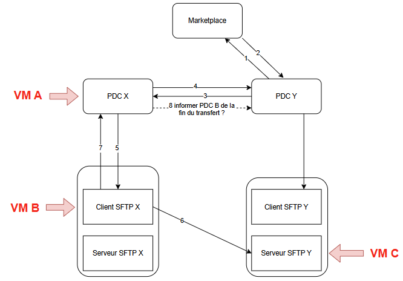

## Description

The PDC or the VM contain :
- The script transfert_A_B_C.sh
- the file `poc-prometheus-sftp.txt` located at /home/ubuntu/poc-prometheus-sftp.txt

## Flow processing :
- consume or provider start exchange
- provider get contract
- provider valid contract
- provider know to use ftp transfer from data representation
- provider retrieve service representation to use ftp transfer
- provider update DataExchange status to `TRASFER_STARTED`
- provider exec command from data representation with parameters from data representation and service representation
- provider ensure the return of the output of the script to the pdc
- provider inform state transfer to consumer

### Format:
`<command> <local_file_provider> <dest_dir_consumer_ftp> <user_consumer> <ip_consumer> <user_provider> <ip_provider>`

## Data representation FTP
```json
{
  "_id": "64b8f0c2e1f4a2b3c4d5e6f7",
  "type": "FTP",
  "ftp": {
    "host": "10.0.1.59",
    "port": "", //optional
    "path":  "/home/ubuntu/poc-prometheus-sftp.txt",
    "credential": "64b8f0c2e1f4a2b3c4d5e6f8", //optional
    "username": "ubuntu", //optional
    "command": "./transfert_A_B_C.sh {path} {service.path} {service.username} {service.host} {credential.key} {host}" //optional
  }
}
```

## service representation FTP
```json
{
  "_id": "64b8f0c2e1f4a2b3c4d5e6f7",
  "type": "FTP",
  "ftp": {
    "host": "10.0.5.70",
    "port": "", //optional
    "path":  "/home/ubuntu/",
    "credential": "64b8f0c2e1f4a2b3c4d5e6f8", //optional
    "username": "ubuntu" //optional
  }
}
```

### Mapping:
* `command`: provider data representation ftp command
* `local_file_provider`: provider data representation ftp path
* `dest_dir_consumer_ftp`: consumer service representation ftp path
* `user_consumer`: consumer service representation ftp credential
* `ip_consumer`: consumer service representation ftp host
* `user_provider`: provider data representation ftp credential
* `ip_provider`: provider data representation ftp host

### Example : 
`./transfert_A_B_C.sh /home/ubuntu/poc-prometheus-sftp.txt /home/ubuntu/ ubuntu 10.0.5.70 ubuntu 10.0.1.59`

## Steps to implement

- (step 4) Provider inform consumer the verification and the starting process of the ftp transfer → update dataExchange status to `TRANSFER_STARTED`
- (step 7) Ensure the return of the output of the script to the pdc
- (step 8) Inform state transfer to consumer