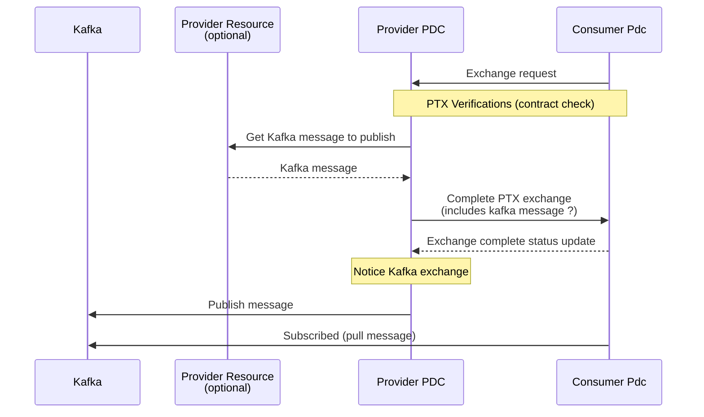
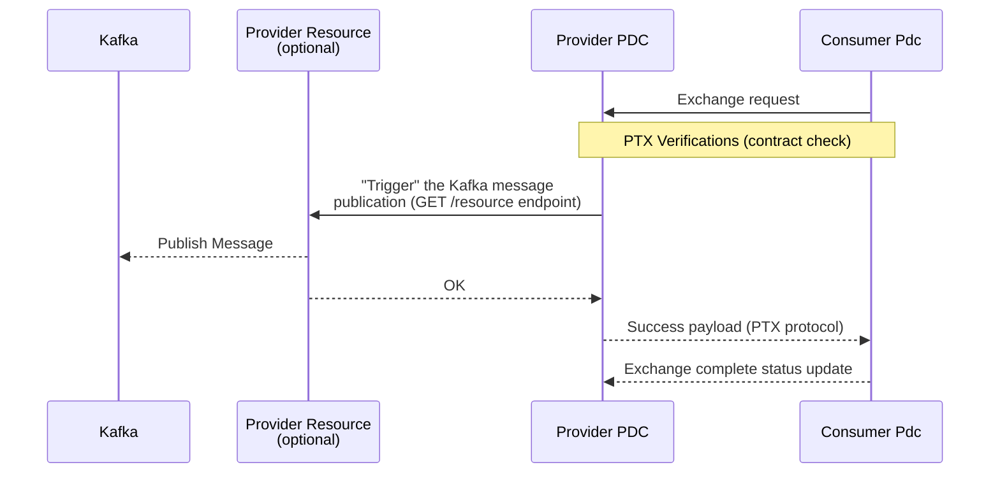

# Message Broker

```mermaid

sequenceDiagram
  participant K as Kafka
  participant PR as Provider Resource<br>(optional)
  participant PPDC as Provider PDC
  participant CPDC as Consumer Pdc

  CPDC ->> PPDC: Exchange request
  Note over PPDC,CPDC: PTX Verifications (contract check)
  PPDC ->> PR: Get Kafka message to publish
  PR -->> PPDC: Kafka message
  PPDC ->> CPDC: Complete PTX exchange <br>(includes kafka message ?) 
  CPDC -->> PPDC: Exchange complete status update
  Note over PPDC: Notice Kafka exchange
  PPDC ->> K: Publish message
  CPDC ->> K: Subscribed (pull message)

```
---

```mermaid

sequenceDiagram
  participant K as Kafka
  participant PR as Provider Resource<br>(optional)
  participant PPDC as Provider PDC
  participant CPDC as Consumer Pdc

  CPDC ->> PPDC: Exchange request
  Note over PPDC,CPDC: PTX Verifications (contract check)
  PPDC ->> PR: "Trigger" the Kafka message<br>publication (GET /resource endpoint)
  PR -->> K: Publish Message
  PR -->> PPDC: OK
  PPDC -->> CPDC: Success payload (PTX protocol)
  CPDC -->> PPDC: Exchange complete status update

```